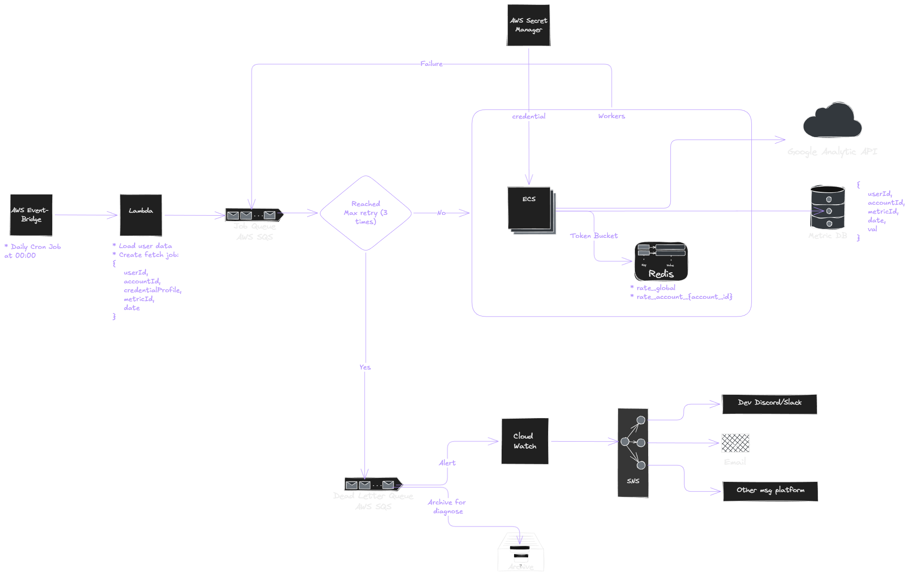

# Google Analytics Metrics Fetching System Design

## Table of Content

> [Overview](#overview)
>
> - [Requirements](#requirements)
>
> [Constraints Analysis](#constraints-analysis)
>
> [Architecture Overview](#architecture-overview)
>
> - [AWS EventBridge](#aws-eventbridge)
> - [Fetch Job Lambda](#fetch-job-lambda)
> - [Job Queue](#job-queue)
> - [Fetch Workers](#fetch-workers)
>
>   - [Rate Limits](#rate-limits)
>
> - [Fetch and Store Google Analytics](#fetch-and-store-google-analytics)
>
> - [Retry Strategy](#retry-strategy)
>
>   - [Dead Letter Queue](#dead-letter-queue)
>
> - [Future Improvements](#future-improvements)

## Overview

The system is designed to fetch Google Analytics metrics for multiple users with multiple accounts. The system is optimized to complete the operation as fast as possible under the given constraints.

### Requirements:

- Up to 100 users
- Each user can have up to 50 accounts
- Each account can fetch up to 200 metrics per day
- Only focus on synchronous fetch API
- Limits
  - Per-account limit: 100 calls per hour
  - Global limit: 50,000 calls per hour
- Retry failed calls up to 3 times
- Fetch job triggers daily at midnight
- Deployable on AWS cloud

## Constraints Analysis

Based on the requirement, the maximum number of fetch API calls can be determined as shown below.

```
100 users * 50 accounts * 200 metrics = 1,000,000 metrics/day
```

and the rate limits are

- Per-account limit: 100 calls per hour
- Global limit: 50,000 calls per hour

From a system-wide perspective, it can be seen that the hard limit is on the global limit. Per-account calls can be parallelized, but they will be eventually capped by the global limit.
So, to complete all these operations, the best time-to-complete is

```
1,000,000 metrics/day / 50,000 call/hour = 20 hours
```

## Architecture Overview



From the diagram above, the execution flow is summarized below:

1. At midnight, [AWS Event Bridge](https://aws.amazon.com/eventbridge/) trigger the fetch job Lambda
2. A [Lambda](https://aws.amazon.com/lambda/) creates fetch jobs
3. The jobs are pushed into [AWS SQS](https://aws.amazon.com/sqs/)
4. The workers consume the jobs and auto-scale accordingly
5. Inside the workers,

   5.1 Acquire both global and per-account tokens

   5.2 Get credential

   5.3 Call Google Analytics API

   5.4 Store the result

   5.5 Retry if needed

6. Repeat steps 3-5 until the queue is empty.

Let's go through the diagram from the left to the right in deeper detail.

### AWS EventBridge

First, the fetch event is triggered by a scheduled cron job using [AWS Event Bridge](https://aws.amazon.com/eventbridge/). This is set such that it triggers a Lambda function for the next operation.

### Fetch Job Lambda

Second, the fetch job is constructed by a [lambda function](https://aws.amazon.com/lambda/). It accesses the database to form a metric-fetching job. An example job payload should look like this.

```json
{
    userId,
    accountId,
    credentialProfile,
    metricId,
    date
}
```

The structure means one job per metric. This enables fine-grained retries and maximal parallelism. This introduces a slight overhead from duplicated `userId`, `accountId`, and `credentialProfile`, but it is acceptable due to rate limit constraints.

Once the job payload is ready, it is pushed into a job queue.

### Job Queue

The Job queue stores fetch jobs, waiting to be consumed by fetch workers. The design not only enables decoupling job creation from the execution but also enables retry operations.
For simplicity, [AWS SQS](https://aws.amazon.com/sqs/) is used for this component.

### Fetch Workers

The workers are essentially compute nodes that consume jobs from the job queue and process them. They are responsible for the following tasks:

- Consume jobs from the queue
- Enforce rate limits
- Get credentials
- Fetch metric via Google Analytics API
- Store results

For security reasons, credentials must be fetched either at deployment time as environment variables or at runtime by the application. In both cases, the credentials must be stored and managed securely. Therefore, [AWS Secret Manager](https://aws.amazon.com/secrets-manager/) is chosen as the solution for securely storing and accessing these credentials.

Since we want to maximize the throughput of the system, [ECS Fargate](https://docs.aws.amazon.com/AmazonECS/latest/developerguide/AWS_Fargate.html) is used for this component because of its ease of auto-scaling. To further emphasize the goodness of ECS, it allows better control over concurrency. For example, we can set up a fleet of containers using [Little's law](https://en.wikipedia.org/wiki/Little%27s_law) such that

```
#containers = global_API_rate_limit [call/s] * average_API_call_latency [s]
            = (50,000 / 60 * 60) * 0.5 // assume 500 ms latency
            = 13.89 * 0.5
            ~ 7
```

Moreover, the auto-scaling rules can be set to be based on the job queue depth.

#### Rate Limits

The rate-limiting mechanism relies on token bucket rate limiting. It is basically a virtual token for each request that will be refilled under a certain rate. [Redis](https://redis.io/) is a perfect solution for this since it can ensure atomicity under concurrent operations.

The token bucket can be implemented as a key-value cache as follows.

```
Key: rate_global
Val: {
  tokens,
  last_refill_ts
}

Key: rate_account_{accountId}
Val: {
  tokens,
  last_refill_ts
}
```

For simplicity, a "lazy-refill' is used as the refilling strategy. Essentially, the token will be both taken and updated upon read. The mechanism is as follows:

1. A worker checks the buckets
2. Calculate the new token value for each bucket as shown in the pseudo code below:

```python
refill_rate = get_refill_rate(bucket_type)
capacity = get_bucket_capacity(bucket_type)
cache = read_from_redis(key)
tokens = cache.tokens or capacity
now = time.now()
last = cache.last or now
elapsed = max(0, now - last)
new_tokens = min(capacity, tokens + elapsed * refill_rate)
```

> For global bucket,
> `refill_rate` = 50,000 / (60 \* 60) ~ 13.89 tokens/sec
>
> For per-account bucket,
> `refill_rate` = 100 / (60 \* 60) ≈ 0.0278 tokens/sec

3. If there is an available token, take the token and update the token cache.
4. Otherwise, just update the token cache.

After this, three things can happen:

1. If a worker fails to acquire a token, the job is sent back to the queue for further retries without incrementing the retry counter.
2. If the worker successfully acquires a token, the worker proceeds with the task.
3. If the worker successfully acquires a token, the worker proceeds with the task, but it fails for any reasons, the job is sent back to the queue for further retries.

It can be seen that there are two main flows: continue and retry. Let's discuss them in order.

### Fetch and Store Google Analytics

The worker sends a request to a synchronous API call to Google Analytics server. Once it returns the result, we store it in the database for future inspection. The schema is shown below.

```
userId | accountId | metricId | date | value
```

### Retry Strategy

When there is a failed operation (failure to acquire a token or failure on the request), that specific job will be pushed onto the job queue again and increment the retry counter. The retry can be done up to 3 times. To prevent the surge on retry, an exponential backoff is used to delay repeated failing tasks. If there is a job that exceeds the allowed retry quota, that job will be pushed into a dead letter queue.

#### Dead Letter Queue

Dead letter queue is implemented using a configured [AWS SQS](https://aws.amazon.com/sqs/). This queue stores problematic fetch jobs for several purposes: alerts, diagnoses, and more.

Dead letters will be stored in an archive, and [CloudWatch](https://aws.amazon.com/cloudwatch/) will alert the devs by sending the message to the configured message platform (Discord, Slack, email, etc.).

## Future Improvements

- If possible, use batch/async metric fetching to reduce total calls.

- Per-user fairness for more evenly distributed per-user workload.
